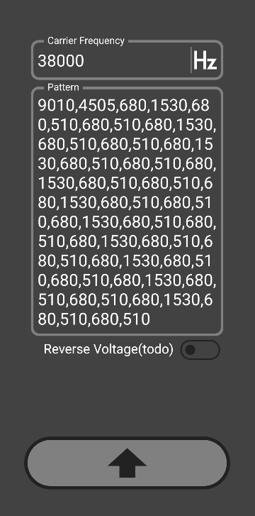

# custom_ir_signal_sender

An app could send completely customed infrared signal. 
It did send IR but didn't work with my AC(YB0F2).Perhaps the encode methods are wrong in the document which they wrote with various strange rules.
